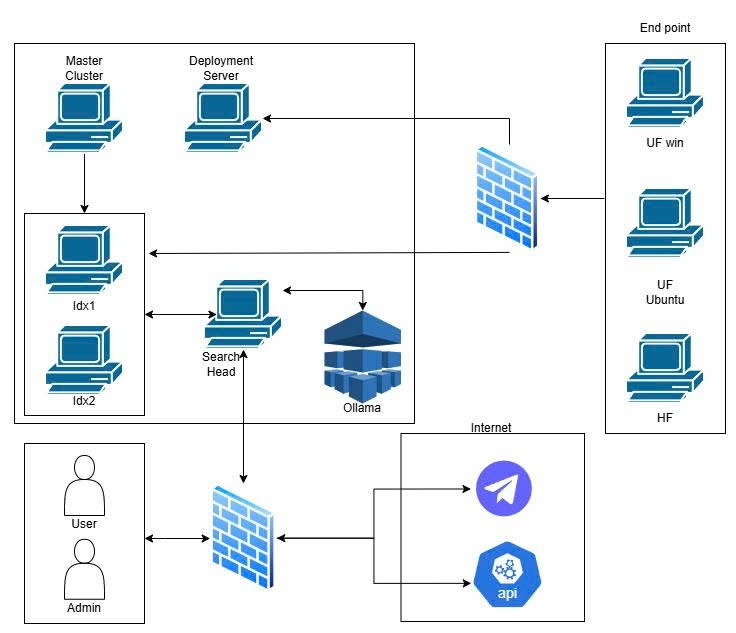

# 🛡️ Splunk SIEM & AI: Automated Threat Detection and Incident Response

[](https://www.splunk.com/)
[](https://www.python.org/)
[](LICENSE)
[](#)

## 📌 Giới thiệu

Dự án này là hệ thống Quản lý Sự kiện và Thông tin Bảo mật (SIEM) được xây dựng trên nền tảng Splunk Enterprise, kết hợp với Mô hình ngôn ngữ lớn (LLM) để tối ưu hóa quy trình vận hành của Trung tâm Điều hành An ninh mạng (SOC). 

Hệ thống không chỉ thu thập và chuẩn hóa dữ liệu từ nhiều nguồn (Windows, Linux, pfSense) mà còn tự động hóa việc phát hiện hành vi tấn công (mapping theo MITRE ATT&CK), phân tích ngữ cảnh log và cảnh báo thời gian thực.

## 🎯 Mục tiêu

- 🔍 Thiết lập hệ thống SIEM tập trung với Splunk Enterprise
- ⚔️ Phát hiện hành vi tấn công T1219 - Remote Access Software (AnyDesk)
- 🤖 Tích hợp LLM hỗ trợ truy vấn, phân tích và điều tra sự cố
- 🚨 Tự động hóa cảnh báo qua Telegram
- 📊 Thiết kế Dashboard giám sát trực quan

## ✨ Tính năng nổi bật

- **Giám sát & Tương quan sự kiện:** Thu thập và chuẩn hóa dữ liệu (CIM) bằng Universal/Heavy Forwarder. Thiết kế rules phát hiện hành vi bất thường theo MITRE ATT&CK.
- **Tích hợp Trợ lý AI (Local LLM):**
  - **Natural Language to SPL:** Chuyển đổi ngôn ngữ tự nhiên (Tiếng Việt) thành câu lệnh SPL.
  - **Log Analyzer:** Cô lập, giải mã và giải nghĩa ngữ cảnh dòng log thô.
  - **Incident Investigator:** Multi-chain AI tự động tổng hợp timeline, ánh xạ MITRE ATT&CK và xuất Playbook ứng phó.
- **Cảnh báo tự động:** Tích hợp Webhook đẩy cảnh báo về Telegram Bot.
- **Trực quan hóa:** Dashboard giám sát với biểu đồ tần suất, Top Talkers và Raw Artifacts.

## 🛠️ Công nghệ sử dụng

**Core SIEM**
- Splunk Enterprise (Search Head, Indexers, Forwarders, Deployment Server)

**AI/Machine Learning**
- LLM Llama 3.2 (3B) chạy cục bộ qua Ollama (Air-gapped)

**Ngôn ngữ & Cú pháp**
- Python (REST API handlers)
- SPL (Search Processing Language)
- JavaScript (Splunk Web Framework)
- Sigma Rules

**Mạng & Hạ tầng**
- Ubuntu Server, Windows 10, pfSense Firewall

## ⚙️ Yêu cầu cấu hình hệ thống

<div align="center">
  
| Thành phần | Hệ điều hành | CPU (core) | Memory (GB) | Disk (GB) |
|------------|--------------|------------|-------------|-----------|
| **Search Head** | Ubuntu Server | 2 | 12 | 60 |
| **Indexer (idx1)** | Ubuntu Server | 2 | 2 | 60 |
| **Indexer (idx2)** | Ubuntu Server | 2 | 2 | 60 |
| **Master Cluster (MC)** | Ubuntu Server | 2 | 2 | 60 |
| **Heavy Forwarder (HF)** | Ubuntu Server | 2 | 2 | 60 |
| **Deployment Server (DS)** | Ubuntu Server | 2 | 2 | 60 |
| **Forwarder (UF nix)** | Linux | 4 | 4 | 60 |
| **Forwarder (UF win)** | Windows 10 | 4 | 4 | 60 |
| **Forwarder (HF)** | Ubuntu Server | 2 | 2 | 60 |
| **pfSense** | pfSense | 1 | 1 | 40 |

</div>
---

## 🔌 Cổng mạng sử dụng

<div align="center">
  
| Port | Source | Destination | Mô tả |
|------|--------|-------------|-------|
| 8000/tcp | Web Browser (user) | Splunk Web | Truy cập giao diện Web của Splunk |
| 8089/tcp | Splunk CLI, SH, Deployer, CM | Indexer, UF, DS | Quản trị nội bộ Splunk (splunkd, REST API), DS |
| 9997/tcp | UF / HF | Indexer | Nhận log từ Universal / Heavy Forwarder |
| 514/udp | Syslog source (router / firewall) | HF hoặc Indexer (Syslog listener) | Nhận log từ thiết bị gửi theo chuẩn syslog |
| 22/tcp | Admin | Splunk server (Linux/SSH) | SSH quản trị hệ thống |
| 443/tcp | Search Head | Telegram | Nhận cảnh báo qua API Telegram |
| 20128/tcp | Search Head | API SmartRouter | Quản lý và điều phối API |
| 11434/tcp | Search Head | Ollama | Truy cập Ollama nội bộ |

</div>
---

## 🏗️ Kiến trúc hệ thống

### Sơ đồ tổng quan

<p align="center">
  
</p>

---

## 📁 Cấu trúc dự án

```text
splunk-ai-security-analytics/
├── README.md
├── LICENSE
├── .gitignore
├── splunk_app/
│   ├── bin/
│   ├── default/
│   ├── local/
│   ├── metadata/
│   └── appserver/
├── docs/
└── images/
```
## 🚀 Hướng dẫn cài đặt & chạy

### 1. Yêu cầu hệ thống

- Ubuntu Server 20.04+
- RAM tối thiểu: 8GB
- Splunk Enterprise 10.4.0
- Python 3.10+
- Ollama

### 2. Cài đặt Splunk

```bash
wget -O splunk-10.4.0-linux-amd64.tgz "https://download.splunk.com/products/splunk/releases/10.4.0/linux/splunk-10.4.0-linux-amd64.tgz"
tar -xvzf splunk-*.tgz -C /opt
/opt/splunk/bin/splunk start --accept-license
```

### 3. Cài đặt Ollama

```bash
curl -fsSL https://ollama.com/install.sh | sh
ollama pull llama3.2:3b
```

### 4. Triển khai Splunk App

```bash
cp -r splunk_app/ /opt/splunk/etc/apps/gemini_spl
/opt/splunk/bin/splunk restart
```

### 5. Cấu hình Forwarder

**Cài Universal Forwarder trên Windows:**
```powershell
msiexec /i splunkforwarder-10.4.0-x64-release.msi /quiet AGREETOLICENSE=Yes
```

**Cài Universal Forwarder trên Linux:**
```bash
wget -O splunkforwarder-10.4.0-linux-amd64.tgz "https://download.splunk.com/products/universalforwarder/releases/10.4.0/linux/splunkforwarder-10.4.0-linux-amd64.tgz"
tar -xvzf splunkforwarder-*.tgz -C /opt
/opt/splunkforwarder/bin/splunk start --accept-license
```

**Cấu hình gửi log về Indexer:**
```bash
/opt/splunkforwarder/bin/splunk add forward-server <IP_Indexer>:9997
```

**Thêm inputs.conf để thu thập log Windows:**
```bash
nano /opt/splunkforwarder/etc/system/local/inputs.conf
```

```conf
[WinEventLog://Security]
index = os_win
disabled = 0

[WinEventLog://Application]
index = os_win
disabled = 0

[WinEventLog://System]
index = os_win
disabled = 0
```

**Khởi động lại UF:**
```bash
/opt/splunkforwarder/bin/splunk restart
```

### 6. Cấu hình Alert Telegram

**Cấu hình Trigger Alert trong Splunk:**
1. Vào Splunk Web → Settings → Searches, reports, and alerts
2. Chọn alert cần cấu hình → Edit → Trigger Actions
3. Thêm Webhook với URL:
```
https://api.telegram.org/bot<BOT_TOKEN>/sendMessage
```

**Nội dung Webhook (JSON):**
```json
{
    "chat_id": "<CHAT_ID>",
    "text": "Alert: $result.message$",
    "parse_mode": "HTML"
}
```

**Kiểm tra Bot hoạt động:**
```bash
curl -X POST https://api.telegram.org/bot<BOT_TOKEN>/sendMessage -d "chat_id=<CHAT_ID>&text=Test Alert from Splunk"
```

## 📸 Kết quả thực nghiệm

### 1. Dashboard giám sát
<p align="center">

</p>
*Dashboard hiển thị tổng quan các cảnh báo và trạng thái hệ thống.*

### 2. AI hỗ trợ truy vấn log
<p align="center">

</p>
*Người dùng nhập câu hỏi bằng ngôn ngữ tự nhiên.*
<p align="center">

</p>
*Dùng câu lệnh SPL của AI vừa sinh để thực hiện truy vấn.*

### 3. AI hỗ trợ phân tích log
<p align="center">

</p>
*Chọn một dòng log bất kỳ để phân tích.*
<p align="center">


</p>
*AI giải nghĩa log và trích xuất thông tin quan trọng.*

### 4. AI hỗ trợ điều tra sự cố
<p align="center">

</p>
*Danh sách các cảnh báo đã kích hoạt.*
<p align="center">

</p>
*Nhập số phút quét mở rộng.*
<p align="center">

</p>
*Dashboard hiển thị Timeline, MITRE ATT&CK và Playbook ứng phó.*

### 5. Cảnh báo Telegram
<p align="center">

</p>
*Tin nhắn cảnh báo được gửi tự động đến Telegram.*

📁 **Xem toàn bộ ảnh:** [images/](images/)

## 🛡️ Giải pháp phòng chống

- Rule SPL phát hiện AnyDesk với tham số `--set-password`
- Cảnh báo Telegram trong vòng vài giây
- AI hỗ trợ truy vấn, phân tích và điều tra

## ⚠️ Disclaimer

> **Dự án này chỉ dành cho mục đích học tập và nghiên cứu.**  
> ✅ Dữ liệu log được xử lý cục bộ, không gửi ra ngoài.  
> ✅ Hệ thống được triển khai trong môi trường Lab.  
> ✅ Mục đích duy nhất là nâng cao kiến thức về SIEM và ứng dụng AI trong SOC.

## 👥 Tác giả

- **Nguyễn Trung Kiên**
- **Nguyễn Văn Khánh**
- **Hoàng Hải Dương** 

## 📄 Giấy phép

Dự án được phân phối dưới giấy phép MIT. Xem file [LICENSE](LICENSE) để biết thêm chi tiết.

*Hà Nội – 2026*
